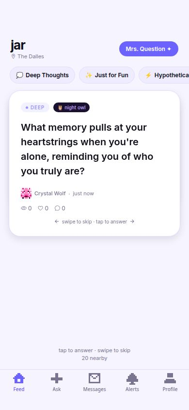
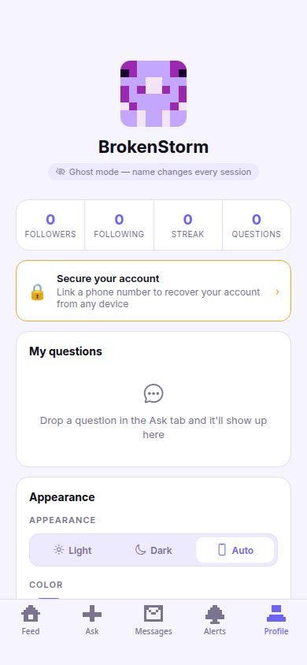

# Jar

**Anonymous Q&A for people nearby**

Ask anything. Answer anonymously. Questions disappear after 24 hours.

[**Open the app**](https://mrs-question.replit.app) &nbsp;&middot;&nbsp; [**GitHub Page**](https://thecathousemp3.github.io/jar-app)

 

 &nbsp;&nbsp;  &nbsp;&nbsp; 

---

## What is Jar?

Jar is a local anonymous Q&A app. Drop a question into the jar and people within your city can read and answer it — without knowing who you are. Questions expire after 24 hours, so nothing sticks around.

No app store. No install. Just open the link.

## Features

- **Location-based feed** — questions from people within your city or up to 30 miles away
- **Ghost mode** — new random name and pixel art avatar every session
- **9 themed categories** — Deep Thoughts, Just for Fun, Hypotheticals, Childhood, Fears, Romance, Philosophy, Hot Takes, Secrets
- **Mrs. Question AI** — tap to generate a question via GPT-4o-mini
- **Reactions** — Bold, Deep, Funny, Felt This
- **Answer streaks** with Night Owl badge for late-night posts
- **Questions expire** — everything is gone after 24 hours
- **Privacy first** — raw coordinates are never stored, only a rough location hash

## Stack

Expo + React Native &middot; Express API &middot; PostgreSQL + Drizzle ORM &middot; OpenAI

---

[**Try it live**](https://mrs-question.replit.app)

